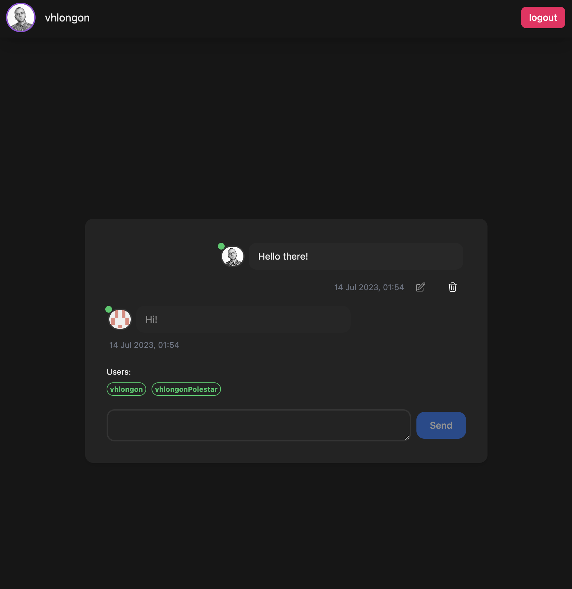

# Solid Chat App

This is a simple chat application built using [Solid](https://solidproject.org/) and [Node.js](https://nodejs.org/). It allows users to create chat rooms and communicate with each other in real-time.

## Tools Used

- [Solid](https://www.solidjs.com/) is the front-end library used in this project.
- [tailwindcss](https://tailwindcss.com/) - utility-first CSS framework
- [ripple-ui](https://www.ripple-ui.com/) - UI components for tailwind
- [urql](https://formidable.com/open-source/urql/) - GraphQL client
- ([graphql-yoga](https://the-guild.dev/graphql/yoga-server)) - GraphQL server
- [Prisma](https://www.prisma.io/) - ORM for Node.js

## How to Run Locally

1. run `yarn` to install all dependencies
2. configure the necessary environment variables in a `.env` file (see below for instructions on how to get a client ID and secret ID from a GitHub OAuth app)
3. run `yarn dev` to start the development server and client

### Github oauth

To get a client ID and secret ID from a GitHub OAuth app, you need to follow these steps:

1. Go to your GitHub account and navigate to the "Settings" page.
2. Click on "Developer settings" in the left sidebar.
3. Click on "OAuth Apps" and then click on the "New OAuth App" button.
4. Fill out the form with the required information, including the name of your app, the homepage URL, and the callback URL.
5. Once you have filled out the form, click on the "Register application" button.
6. On the next page, you will see your client ID and client secret. Make sure to keep these values secret, as they are used to authenticate your app with GitHub.
7. You can now use these values to authenticate your app with GitHub. Copy those and add them to your `.env` file.
